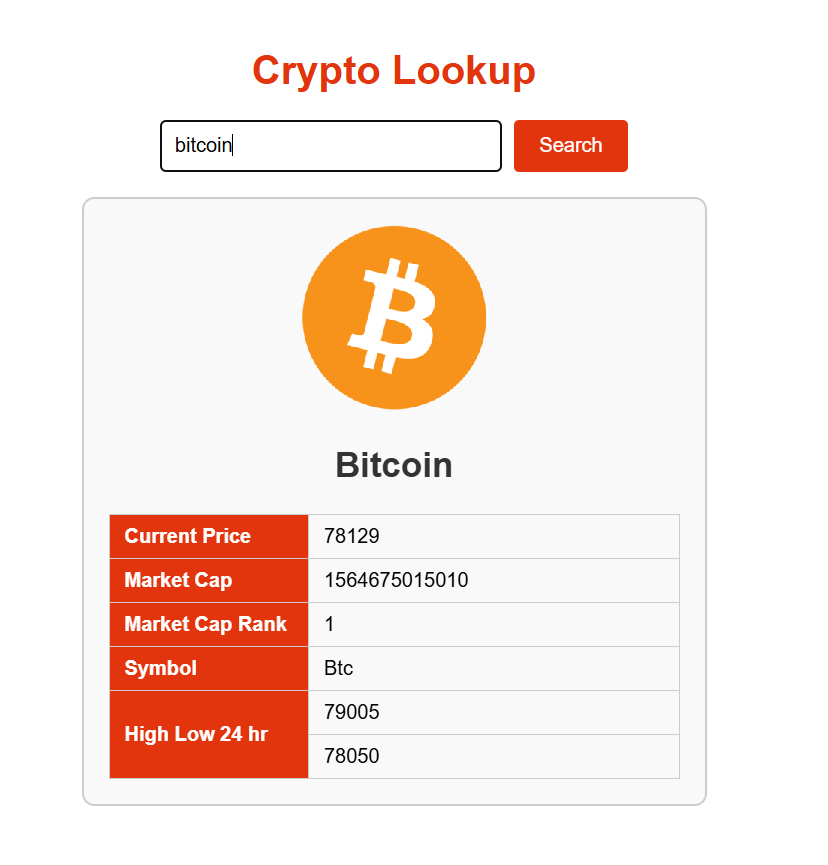

# CryptoCalc

CryptoCalc is a Node.js + Express web application that fetches live cryptocurrency data from the CoinGecko API and displays it in a browser. The project demonstrates full-stack async request flow: browser ➜ Express server ➜ external API ➜ browser.

## What this program does

- Serves static frontend files from `public/`
- Accepts a crypto ID route like `/bitcoin`
- Fetches market data from CoinGecko
- Returns a JSON response with the selected crypto's price, market cap, rank, and 24-hour high/low
- Displays the crypto information dynamically in the browser

## How to run

1. Install dependencies: `npm install`
2. Start the server: `npm start`
3. Open: `http://localhost:3000`

## New concepts used

- Express static file serving
- Async/await in Node.js
- Fetching external API data from server-side code
- Proxy pattern for frontend requests
- Tabels in HTML
- How to creat API links

## Author

- Isaiah Guilliatt
- GitHub: https://github.com/isguil02/CryptoCalc

## AI usage 

AI was used to generate JS docs & Read me and then I went through and changed it a bunch
Comments are in the code to show where it was used
And AI was heavily used on change app.js to match index instead of individually slowly but didn't generate any new content

# UI

